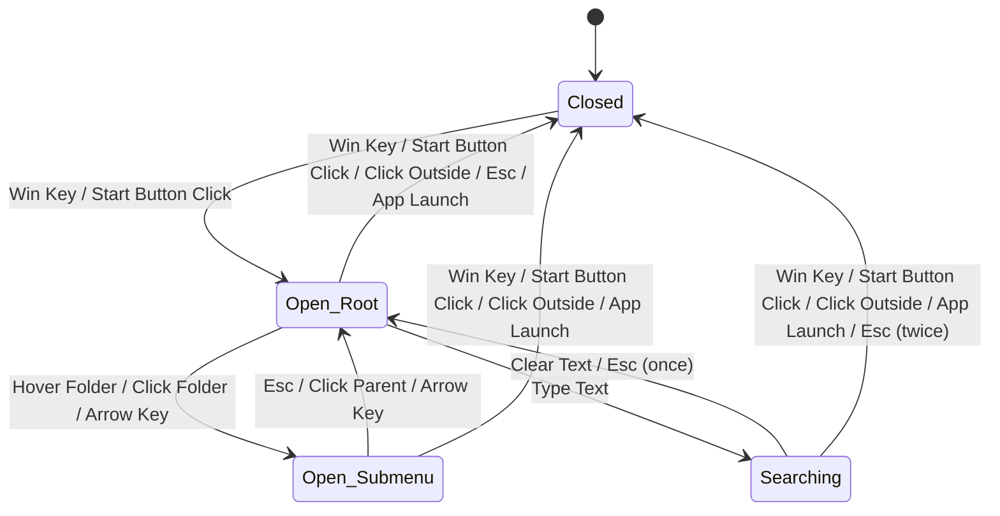

# Start Menu Behavioral Contract

This document defines the formal behavioral contract for the Open-Shell Start Menu, including states, transitions, and external interactions.

## 1. States

| State | Description |
|-------|-------------|
| `Closed` | No Start Menu windows are visible or active. |
| `Open (Root)` | The main Start Menu is visible and has focus. |
| `Open (Submenu)` | One or more submenus are visible in addition to the root menu. |
| `Searching` | The Start Menu is open and the search box is active with a non-empty query. |

## 2. State Transitions

## 3. Valid Transitions and Triggers

| Current State | Event | Trigger | Next State | Side Effects |
|---------------|-------|---------|------------|--------------|
| `Closed` | `Toggle` | Win Key / Start Button Click | `Open (Root)` | Set focus to menu, play "Open" sound. |
| `Open` | `Toggle` | Win Key / Start Button Click | `Closed` | Restore focus, play "Close" sound. |
| `Open` | `Deactivate` | Click Outside / Focus Change | `Closed` | Close all menu windows. |
| `Open (Root)` | `OpenSub` | Hover Folder / Click Folder | `Open (Submenu)` | Create/Show submenu window. |
| `Open (Submenu)`| `CloseSub` | Esc / Hover Other Root Item | `Open (Root)` | Destroy submenu window. |
| `Open` | `Execute` | Click App / Enter Key | `Closed` | Launch process, close all menu windows. |
| `Open` | `Cancel` | Esc (at root) | `Closed` | Close all menu windows. |
| `Open` | `Search` | Typing | `Searching` | Update results view. |

## 4. External Interactions

### 4.1. Shell Interaction
- **Taskbar Positioning:** The menu must query `SHAppBarMessage` to position itself correctly relative to the taskbar.
- **Foreground Handling:** The menu uses `SetForegroundWindow` and `AllowSetForegroundWindow` to manage focus.
- **Process Launching:** Applications are launched using `ShellExecuteEx` or `CreateProcess`.

### 4.2. Hotkeys
- The menu registers a global hotkey (`RegisterHotKey`) for the Windows key to intercept it before the system's default Start Menu responds.

### 4.3. Explorer Integration
- The menu monitors for `TaskbarCreated` message to re-establish hooks if Explorer restarts.

## 5. Contract IDs for Test Mapping

- `menu-open-on-hotkey`: Win key or registered start hotkey opens/closes menu.
- `registry-drives-config`: persisted settings alter runtime menu configuration.
- `start-button-replacement`: initialization can replace/intercept start button behavior.
- `skin-load-fallback`: missing skin resources fall back to a default skin safely.
- `multi-monitor-fallback`: menu functions correctly with a single-monitor fallback path.
- `menu-population`: shell namespace/provider data is transformed into menu entries.
- `wine-feature-degradation`: high-risk shell features degrade gracefully on Wine.

<!-- WINDOWS-SPECIFIC: Taskbar positioning currently depends on SHAppBarMessage calls in Src/StartMenu/StartMenuDLL/StartMenuDLL.cpp:605 and MenuContainer.cpp:8196. -->
<!-- WINDOWS-SPECIFIC: Foreground handling currently relies on AllowSetForegroundWindow in Src/StartMenu/StartMenu.cpp:657 and SetForegroundWindow usage in StartMenuDLL code paths. -->
<!-- WINDOWS-SPECIFIC: TaskbarCreated monitoring uses RegisterWindowMessage("TaskbarCreated") in Src/StartMenu/StartMenu.cpp:693. -->
<!-- WINDOWS-SPECIFIC: Menu visual effects rely on DwmExtendFrameIntoClientArea in Src/StartMenu/StartMenuDLL/MenuContainer.cpp:4429. -->
<!-- NEEDS ABSTRACTION: Start button and taskbar integration traverse Shell_TrayWnd/TrayNotifyWnd class hierarchy in Src/StartMenu/StartMenuDLL/StartMenuDLL.cpp:456 and 3141. -->

## Portability Assessment

### Fully Portable
- State machine semantics for Closed/OpenRoot/OpenSubmenu/Searching.
- Search transition rules and Escape-driven close semantics.

### Requires Shim
- Hotkey registration and dispatch (`RegisterHotKey`) should be behind `IHotkeyManager`.
- Taskbar position and start-button interception should be behind `ITaskbarAccess`.
- Settings persistence should be behind `IRegistryProvider`.
- Skin discovery/loading should be behind `ISkinLoader`.

### Incompatible / Feature-Flag Required
- DWM composition-only behavior (`DwmExtendFrameIntoClientArea`, `DwmSetWindowAttribute`) should be disabled if unsupported.
- Explorer window-class assumptions (`Shell_TrayWnd`, `ReBarWindow32`, `TrayNotifyWnd`) require platform mapping or feature gating.
- Explorer process hook/injection flows (`SetWindowsHookEx` into shell process) require a feature flag in non-native environments.

// [CODEX] Last modified by: Codex
// [CODEX] Phase: 1
// [CODEX] Summary: Added contract IDs and portability assessment annotations for abstraction planning.
