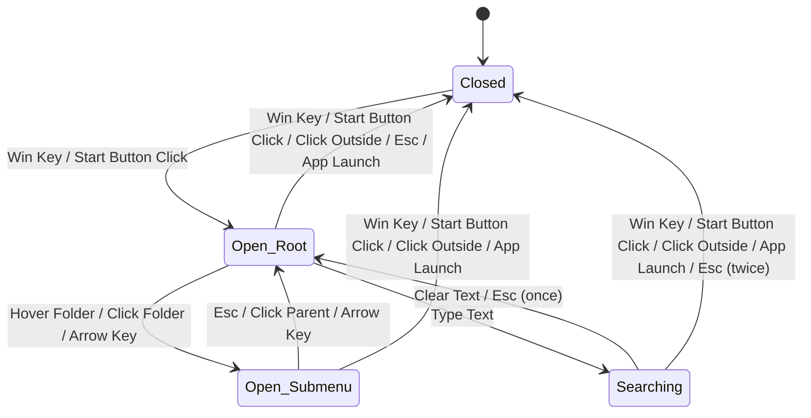

# Start Menu Behavioral Contract

This document defines the formal behavioral contract for the Open-Shell Start Menu, including states, transitions, and external interactions.

## 1. States

| State | Description |
|-------|-------------|
| `Closed` | No Start Menu windows are visible or active. |
| `Open (Root)` | The main Start Menu is visible and has focus. |
| `Open (Submenu)` | One or more submenus are visible in addition to the root menu. |
| `Searching` | The Start Menu is open and the search box is active with a non-empty query. |

## 2. State Transitions

## 3. Valid Transitions and Triggers

| Current State | Event | Trigger | Next State | Side Effects |
|---------------|-------|---------|------------|--------------|
| `Closed` | `Toggle` | Win Key / Start Button Click | `Open (Root)` | Set focus to menu, play "Open" sound. |
| `Open` | `Toggle` | Win Key / Start Button Click | `Closed` | Restore focus, play "Close" sound. |
| `Open` | `Deactivate` | Click Outside / Focus Change | `Closed` | Close all menu windows. |
| `Open (Root)` | `OpenSub` | Hover Folder / Click Folder | `Open (Submenu)` | Create/Show submenu window. |
| `Open (Submenu)`| `CloseSub` | Esc / Hover Other Root Item | `Open (Root)` | Destroy submenu window. |
| `Open` | `Execute` | Click App / Enter Key | `Closed` | Launch process, close all menu windows. |
| `Open` | `Cancel` | Esc (at root) | `Closed` | Close all menu windows. |
| `Open` | `Search` | Typing | `Searching` | Update results view. |

## 4. External Interactions

### 4.1. Shell Interaction
- **Taskbar Positioning:** The menu must query `SHAppBarMessage` to position itself correctly relative to the taskbar.
- **Foreground Handling:** The menu uses `SetForegroundWindow` and `AllowSetForegroundWindow` to manage focus.
- **Process Launching:** Applications are launched using `ShellExecuteEx` or `CreateProcess`.

### 4.2. Hotkeys
- The menu registers a global hotkey (`RegisterHotKey`) for the Windows key to intercept it before the system's default Start Menu responds.

### 4.3. Explorer Integration
- The menu monitors for `TaskbarCreated` message to re-establish hooks if Explorer restarts.
